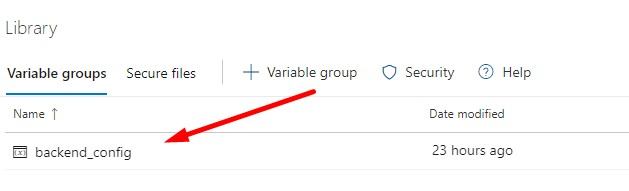
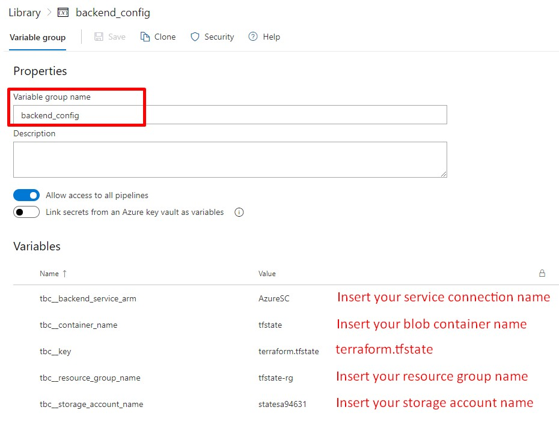
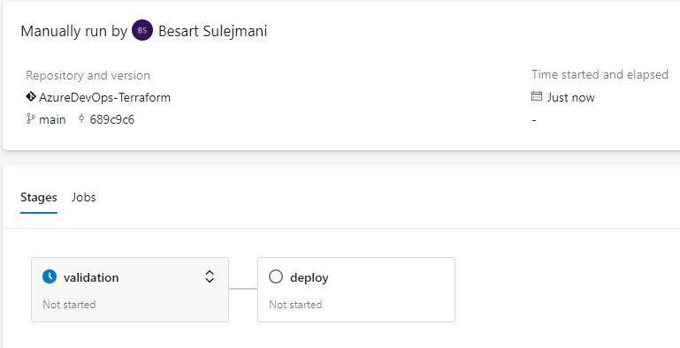
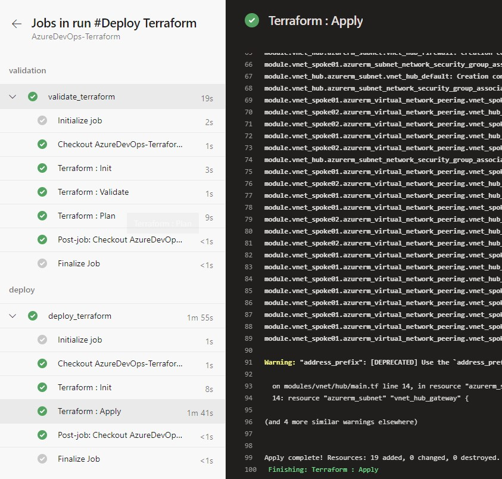

# Azure DevOps and Terraform

The code found in this repository creates a Hub and Spoke topology in Azure, implemented via Azure DevOps pipelines with Terraform.

Microsoft docs: [Hub-spoke topology](https://docs.microsoft.com/en-us/azure/architecture/reference-architectures/hybrid-networking/hub-spoke?tabs=cli)

This code can be used for learning purposes or other purposes. It doesn't include all of the steps in detail so some research while deploying it will be needed for beginners but that is the best way to learn :-) Just have fun in the process!

---
## Prepare Your Environment

### - Azure subscription (free will do)

Knowledge of Azure and how to create resources is needed. [Get started](https://azure.microsoft.com/en-us/)
### - Azure DevOps organization (free will do)

To get started with Azure DevOps, use the same account as your Azure subscription. [Get started](https://azure.microsoft.com/en-us/services/devops/)

---

### Tools for your local machine if you want to make changes to the code:
### VS Code
| Name                                    | Installation Method    | Install Command                                    |
| ----------------------------------------| -----------------------| ---------------------------------------------------|
| VS Code                                 | Download & Install     | [Download here](https://code.visualstudio.com/)    |
| Azure Terraform                         | VS Code extension      | Install in VS Code                                 |
| Hashicorp  Terraform               | VS Code extension      | Install in VS Code                                 |

### Terraform

| Name                      | Installation Method    | Install Command                                              |
| ------------------------  | ---------------------- | -----------------------------------------------------------  |
| Terraform                 | Download & Install     | [Download here](https://www.terraform.io/downloads.html)     |

---
## Terraform code

The Terraform code can be found in the folder `Terraform` and is for anyone that wants to create a Hub and Spoke topology in Azure.

*NOTE: I've added the .tfvars file into the repo, which you would normally add in your .gitignore file, to give you minimal struggle to set things up*

## YAML code

There are two YAML files for two seperate pipelines in Azure DevOps. One is for validating Terraform and deploying the Infrastructure. The other one is for destroying the infrastructure if needed.

## Set up Azure

You will need to set up a resource group and storage account in Azure to store the Terraform state file. You'll need the names of these resources to add them as variables to your pipelines. 

- Create a resource group
- Create a storage account within that resource group
- Create a container within that storage account
## Set up Azure DevOps

Once you have signed up for Azure DevOps and created an organization, create your project. Check the "Get started" URL above. 
- Import the code within Azure Repos (select the "Existing Azure Pipelines Yaml file" configuration)
- Install the Terraform extension for Azure DevOps: [Get it here](https://marketplace.visualstudio.com/items?itemName=ms-devlabs.custom-terraform-tasks)

Create a service connection that enables Azure Pipelines to access your Azure subscription. Azure Pipelines uses this service connection to deploy the Terraform configuration.
- Set up a service connection with the type being Azure Resource Manager (automatic)

---
### Setup Azure Pipelines

In Azure DevOps go to Pipelines -> Library and create the variable group as shown in the image (backend_config is referenced in the YAML files as a variable group). 

Add the following variable names and insert your own values (except the \'terraform.tfstate' thats the value you should insert)

- tbc__backend_service_arm
- tbc__container_name
- tbc__key
- tbc__resource_group_name
- tbc__storage_account_name

---

Now is where the fun stuff comes in to play and where you're going to build the pipeline(s).

- In Azure DevOps go to Pipelines and click \'Create pipeline'. 
- Select Azure Repos cause that is where you stored the code and for the configuration select "Existing Azure Pipelines YAML file".
- In the path selection you should have two options. One is the deploy and the other is the destroy file. Select the deploy file and click Ok.
- Run your pipeline and watch it automatically rollout your Hub-Spoke network in Azure

Watch the stages and steps deploying your code:

After the deployment has finished, go over to the Azure portal and check out your newly created resources with Terraform. You should have a 'dev-engineering-rg' resource group with the resources created.

